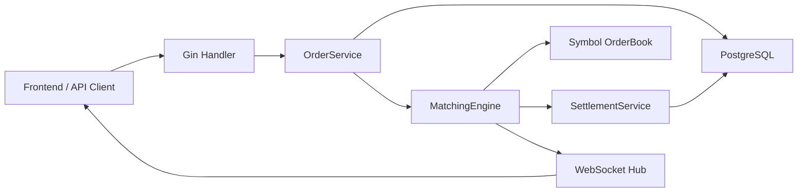
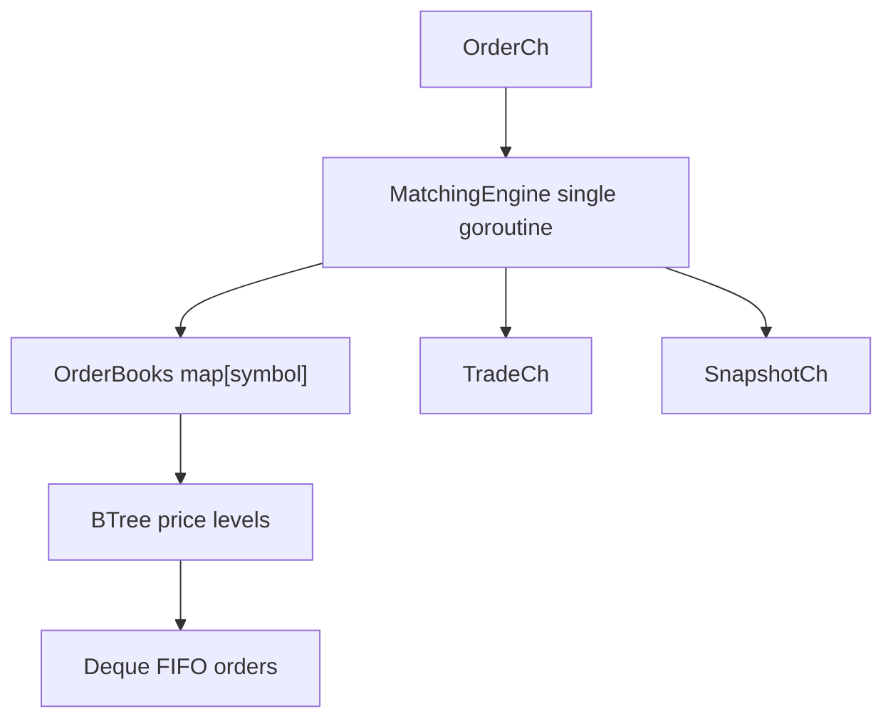
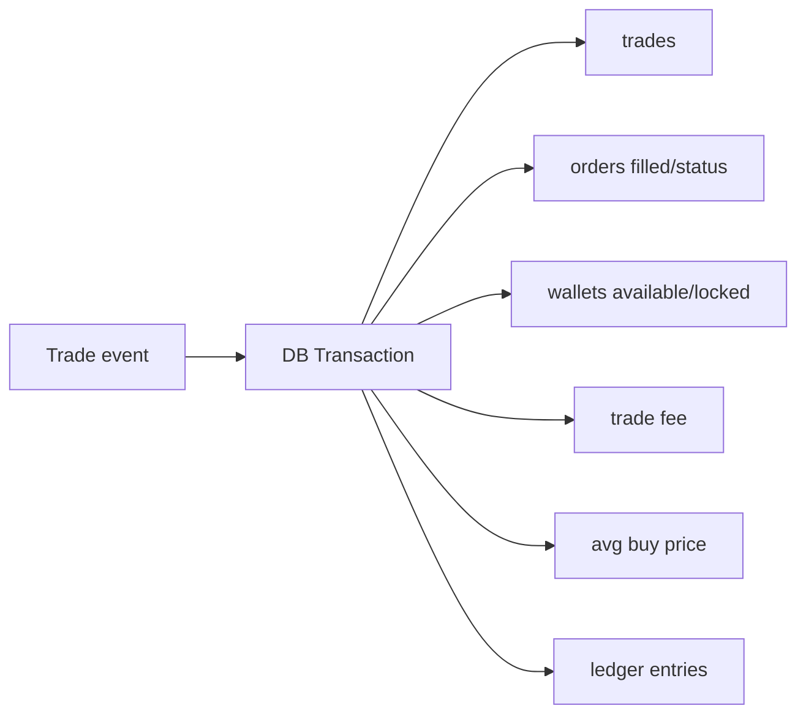

# Go Exchange Backend

Go 기반 실시간 가상자산 거래소 MVP 백엔드입니다.
회원가입과 로그인, 주문 접수, 메모리 매칭엔진, 체결 정산, 지갑 hold/release, 수수료, 평균매수가, ledger 기록, WebSocket 실시간 스트림을 하나의 모듈러 모놀리스 구조로 구현했습니다.

이 프로젝트는 실제 입출금이나 외부 보관 지갑을 제공하는 서비스가 아니라, 거래소의 핵심 도메인인 주문, 매칭, 체결, 정산, 잔고 정합성을 학습하고 검증하기 위한 포트폴리오 프로젝트입니다.

## 핵심 기능

| 영역 | 구현 내용 |
| --- | --- |
| 인증 | 회원가입, 로그인, JWT 발급, 인증 미들웨어 |
| 주문 | 지정가/시장가 BUY/SELL, decimal string 기반 가격/수량 처리 |
| 주문 정책 | 코인별 tick size, 수량 step, 주문 타입별 검증 |
| 매칭엔진 | 심볼별 오더북, Price-Time Priority, 부분 체결, 다중 체결 |
| 자료구조 | 가격 레벨은 `google/btree`, 같은 가격대 FIFO는 `gammazero/deque` 사용 |
| 자기 체결 방지 | 동일 사용자 주문끼리 체결되지 않도록 매칭 대상에서 제외 |
| 시장가 주문 | 시장가 매수는 KRW 예산 기준, 시장가 매도는 수량 기준 non-rest 처리 |
| 지갑 | `available_balance`와 `locked_balance` 분리 |
| Hold/Release | 주문 접수 시 자산 lock, 취소/미체결 시장가 잔액 release |
| 정산 | Trade, Order, Wallet, Fee, AvgBuyPrice, Ledger를 DB transaction으로 처리 |
| 멱등성 | engine event id와 idempotency key로 중복 정산 방지 |
| 실패 추적 | 정산 실패 이벤트를 `failed_settlements`에 영속 기록하고 resolve 가능 |
| 재시작 복구 | 서버 시작 시 DB의 PENDING/PARTIAL 주문을 매칭엔진에 bootstrap |
| 실시간 스트림 | WebSocket orderbook/trade broadcast, slow client drop, origin whitelist |
| 오더북 초기 동기화 | REST `/orderbook` snapshot과 WebSocket stream을 함께 사용 |
| 마이그레이션 | goose 기반 SQL migration runner |
| 개발 도구 | 로컬 시연용 dev wallet funding API |

자세한 MVP 검증 항목은 [docs/MVP_CHECKLIST.md](docs/MVP_CHECKLIST.md)를 참고하세요.

## 기술 스택

- Go 1.25.7
- Gin 1.12.0
- GORM 1.31.1
- PostgreSQL driver 1.6.0
- goose 3.27.1
- shopspring/decimal 1.4.0
- google/btree 1.1.3
- gammazero/deque 1.2.1
- Gorilla WebSocket 1.5.3
- golang.org/x/crypto 0.50.0
- testify 1.11.1

## 프로젝트 구조

```text
cmd/                      app bootstrap, routing, goroutine wiring
config/                   DB, env, market rule config
internal/auth/            password hashing, JWT
internal/dbmigration/     goose migration runner
internal/handler/         HTTP handlers
internal/httpapi/         structured response and error helpers
internal/matching/        in-memory matching engine and order book
internal/middleware/      auth and dev-tool middleware
internal/model/           GORM models
internal/repository/      DB query and transaction helpers
internal/service/         order, settlement, wallet, market policy services
internal/ws/              WebSocket hub and handler
migrations/               versioned SQL migrations
```

상세 설계는 [docs/ARCHITECTURE.md](docs/ARCHITECTURE.md)를 참고하세요.

## 아키텍처 요약



주문 접수는 DB transaction 안에서 지갑 잔고를 먼저 hold한 뒤 주문을 생성하고, transaction 성공 이후 매칭엔진 채널로 전달합니다.
매칭엔진은 단일 goroutine에서 주문과 취소 명령을 직렬 처리해 오더북 race를 줄입니다.
체결 이벤트는 `SettlementService`가 DB transaction으로 저장, 주문 fill 누적, 지갑 변경, 수수료, 평균매수가, ledger 기록을 함께 처리합니다.

## 매칭엔진

매칭엔진은 심볼별 오더북을 분리해 BTC, ETH, XRP 같은 서로 다른 마켓의 주문이 섞이지 않도록 구성했습니다.

- 가격 레벨 정렬: `google/btree`
- 같은 가격대 시간 우선순위: `gammazero/deque`
- 처리 모델: `OrderCh`, `CancelCh`, `SnapshotReq`를 단일 goroutine에서 직렬 처리
- 지정가 BUY: best ask부터 가격 조건이 맞는 동안 반복 체결
- 지정가 SELL: best bid부터 가격 조건이 맞는 동안 반복 체결
- 시장가 BUY: 예산이 허용하는 범위에서 가능한 호가를 즉시 소진하고 잔액은 release
- 시장가 SELL: 보유 수량을 가능한 호가에 즉시 체결하고 남은 수량은 release
- 자기 체결 방지: 같은 user id의 반대 주문은 체결하지 않음
- 오더북 snapshot: REST `/orderbook`과 WebSocket orderbook 메시지로 제공



## 정산과 지갑

지갑은 사용 가능한 잔고와 주문에 묶인 잔고를 분리합니다.

- `available_balance`: 새 주문이나 출금 가능 영역
- `locked_balance`: 미체결 주문에 예약된 영역
- BUY 지정가 주문: KRW를 hold
- SELL 지정가 주문: 코인을 hold
- 주문 취소: remaining 기준으로 locked를 available로 release
- 체결 정산: buyer/seller 양쪽 주문, 지갑, 수수료, 평균매수가, ledger를 하나의 DB transaction으로 반영



## 복구와 실패 추적

서버가 재시작되면 메모리 오더북은 비어 있으므로, bootstrap 단계에서 DB의 open order를 다시 매칭엔진에 복원합니다.

- 조회 대상: `PENDING`, `PARTIAL`
- 복원 수량: `amount - filled_amount`
- 정렬 기준: `created_at ASC`, `id ASC`
- bootstrap 실패 시 API를 열지 않고 서버 시작을 중단

정산 실패는 로그만 남기지 않고 `failed_settlements`에 기록합니다.
같은 idempotency key의 실패는 row를 계속 늘리지 않고 retry count와 최신 error를 갱신합니다.
운영자 확인 이후 resolve 상태로 전환할 수 있습니다.

## 실행 방법

PostgreSQL이 실행 중이고 `goexchange` 데이터베이스가 있어야 합니다.

```powershell
createdb -h 127.0.0.1 -p 5432 -U postgres goexchange
```

로컬 설정 파일을 만듭니다.

```powershell
Copy-Item .env.example .env.local
```

예시:

```text
GOEXCHANGE_DB_PASSWORD=<local-postgres-password>
GOEXCHANGE_MARKET_RULES_PATH=config/market_rules.json
GOEXCHANGE_ENABLE_DEV_TOOLS=true
GOEXCHANGE_DEV_TOOLS_TOKEN=<local-dev-tools-token>
GOEXCHANGE_ENABLE_UPBIT=false
GOEXCHANGE_CORS_ALLOWED_ORIGINS=http://localhost:3000,http://127.0.0.1:3000
GOEXCHANGE_WS_ALLOWED_ORIGINS=http://localhost:3000,http://127.0.0.1:3000
```

서버 실행:

```powershell
go run ./cmd
```

서버 시작 시 GORM AutoMigrate 이후 goose migration이 적용됩니다.
정상 기동 후 `/ping`, `/auth/*`, `/orders`, `/wallets`, `/trades`, `/markets/rules`, `/orderbook`, `/ws`를 사용할 수 있습니다.

## API 요약

| Method | Path | 인증 | 설명 |
| --- | --- | --- | --- |
| GET | `/ping` | 없음 | 헬스 체크 |
| POST | `/auth/register` | 없음 | 사용자 생성, JWT 반환 |
| POST | `/auth/login` | 없음 | 로그인, JWT 반환 |
| GET | `/markets/rules?coin_symbol=BTC` | 없음 | 시장 정책 조회 |
| GET | `/orderbook?coin_symbol=BTC` | 없음 | 현재 오더북 snapshot 조회 |
| POST | `/orders` | 필요 | 지정가/시장가 주문 생성 |
| DELETE | `/orders/:id` | 필요 | 미체결/부분체결 주문 취소 |
| GET | `/orders` | 필요 | 내 주문 목록 |
| GET | `/orders/:id` | 필요 | 내 주문 단건 |
| GET | `/wallets` | 필요 | 내 지갑 목록 |
| GET | `/trades` | 필요 | 내 체결 목록 |
| POST | `/dev/wallets/fund` | 필요 + dev token | 로컬 개발용 지갑 충전 |
| GET | `/ws` | origin whitelist | orderbook/trade stream |

금액과 수량은 JSON decimal string으로 주고받습니다.

## 테스트

기본 테스트:

```powershell
go test ./...
go vet ./...
go test -count=20 ./internal/matching
```

PostgreSQL 통합 테스트는 `GOEXCHANGE_TEST_DATABASE_DSN`이 있을 때 실제 DB에 연결합니다.

```powershell
docker compose -f docker-compose.test.yml up -d
$env:GOEXCHANGE_TEST_DATABASE_DSN="host=localhost user=goexchange_test password=goexchange_test_password dbname=goexchange_test port=55432 sslmode=disable"
go test -run Integration -v ./internal/repository ./internal/service
docker compose -f docker-compose.test.yml down -v
```

자세한 테스트 환경은 [TESTING.md](TESTING.md)를 참고하세요.

## 로컬 시연 흐름

1. 백엔드 `.env.local`에서 `GOEXCHANGE_ENABLE_DEV_TOOLS=true`와 `GOEXCHANGE_DEV_TOOLS_TOKEN`을 설정합니다.
2. 백엔드를 `go run ./cmd`로 실행합니다.
3. 프론트엔드를 `npm run dev`로 실행합니다.
4. 계정 A/B를 만들고, A에는 코인, B에는 KRW를 충전합니다.
5. A가 지정가 매도 주문을 올리고, B가 지정가 또는 시장가 매수로 체결합니다.
6. 주문 상태, 지갑 available/locked, 수수료, 평균매수가, 체결 내역, 오더북 갱신을 확인합니다.
7. 서버 재시작 후 open order bootstrap 복원 흐름을 확인합니다.

상세 시연 절차는 [docs/DEMO_SCENARIO.md](docs/DEMO_SCENARIO.md)를 참고하세요.
