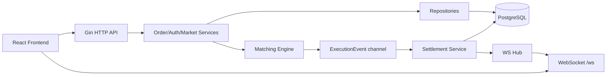
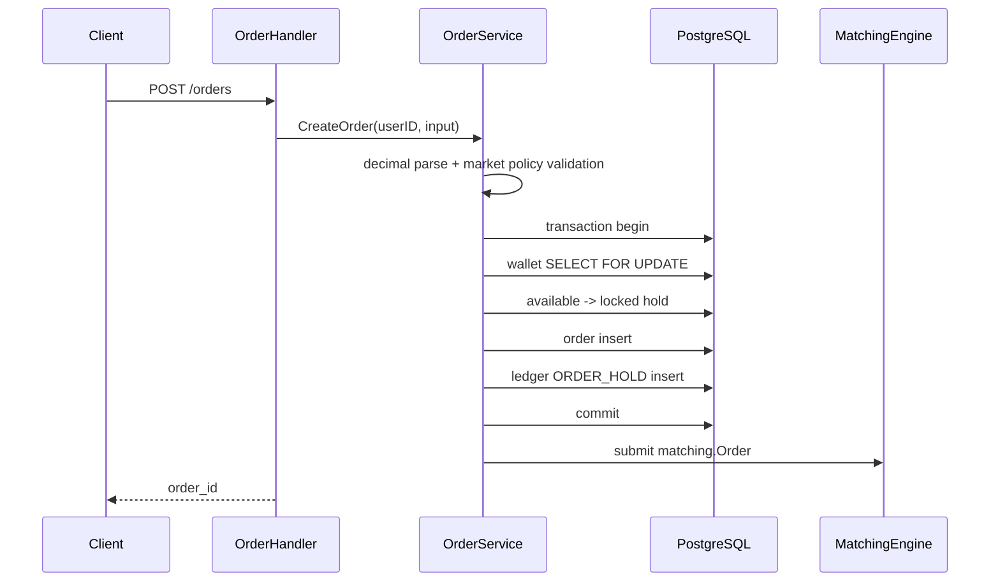
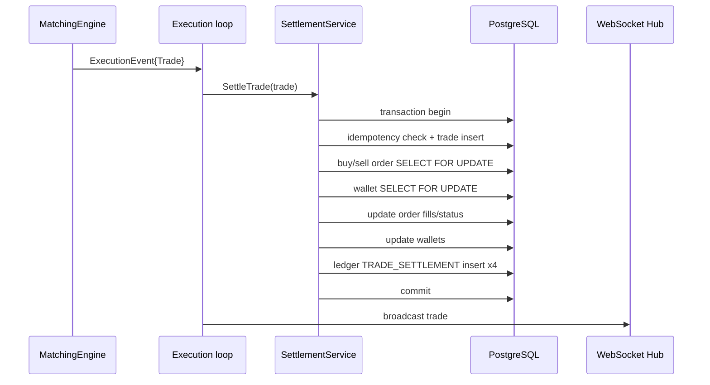
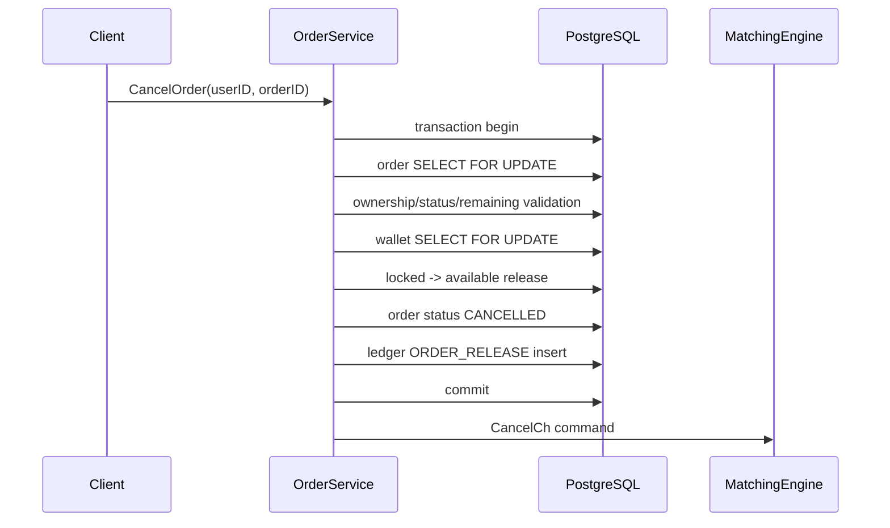

# Architecture

Go Exchange Backend는 모듈러 모놀리스 구조입니다. 프로세스는 하나지만 handler, service, repository, matching, ws, auth, migration 책임을 분리했습니다.

## 전체 흐름



## 레이어 역할

| 레이어 | 역할 |
| --- | --- |
| `cmd/main.go` | 설정 로드, DB 연결, migration, service wiring, goroutine 시작, router 등록 |
| `config` | DB DSN, env file, runtime flag |
| `handler` | HTTP request binding, auth user 추출, response/error 매핑 |
| `service` | 주문 정책, hold/release, 정산, market rules, failed settlement |
| `repository` | GORM query, row lock, transaction scope |
| `matching` | 순수 인메모리 오더북과 체결 이벤트 생성 |
| `ws` | WebSocket client 관리와 broadcast |
| `model` | GORM table model |
| `migrations` | goose SQL migration |

## 매칭엔진

매칭엔진은 단일 goroutine + channel로 직렬화됩니다.

```text
OrderCh / CancelCh
        |
        v
MatchingEngine.Start goroutine
        |
        +--> symbol별 OrderBook
        +--> ExecutionEventCh
        +--> SnapshotCh
```

자료구조:

- `map[string]*OrderBook`: 코인 심볼별 오더북 분리
- `btree.BTree`: 가격 레벨 정렬
- `deque.Deque`: 같은 가격 안에서 FIFO 주문 큐
- best ask: sell tree의 `Min`
- best bid: buy tree의 `Max`

지원 정책:

- 지정가 매수는 `best ask <= buy price` 동안 반복 체결
- 지정가 매도는 `best bid >= sell price` 동안 반복 체결
- 시장가 매수는 quote budget 안에서 가능한 ask를 소비하고 남은 예산은 rest하지 않음
- 시장가 매도는 수량 안에서 가능한 bid를 소비하고 남은 수량은 rest하지 않음
- 같은 사용자 주문은 self-trade 방지를 위해 건너뜀
- 남은 지정가 수량은 오더북에 rest
- 완전히 비워진 가격 레벨은 제거
- snapshot은 depth 제한을 적용해 broadcast

## 주문 생성



중요한 점:

- DB transaction이 성공한 뒤에만 엔진에 주문을 넣습니다.
- 주문 생성 중 wallet hold가 실패하면 order row와 engine submit이 생기지 않습니다.
- 시장가 매수는 `quote_amount`, 시장가 매도는 `amount`를 기준으로 hold합니다.

## 체결/정산



정산 불변식:

- `PENDING`, `PARTIAL` 주문만 정산 가능
- 이미 정산된 idempotency key는 wallet/order/ledger를 다시 변경하지 않음
- 같은 key인데 payload가 다르면 conflict
- buyer fee와 seller fee는 KRW로 부과
- buyer coin은 체결 수량 그대로 증가
- seller KRW는 체결대금에서 seller fee를 뺀 금액만 증가

## 주문 취소



한계:

- DB cancel과 engine cancel은 완전한 단일 원자 경계가 아닙니다.
- stale trade가 늦게 들어오면 settlement status guard가 거부하고 failed_settlements에 기록합니다.

## 재시작 복구

서버 시작 시 DB의 open order를 matching engine에 복원합니다.

조건:

- `status IN (PENDING, PARTIAL)`
- `amount > filled_amount`
- `created_at ASC, id ASC`

부분 체결 주문은 `amount - filled_amount`만 복원합니다. bootstrap 실패 시 API를 열지 않고 서버를 종료합니다.

## 원장

`ledger_entries`는 wallet balance event log입니다.

| entry_type | 발생 시점 |
| --- | --- |
| `DEV_FUND` | 개발용 지갑 충전 |
| `ORDER_HOLD` | 주문 생성 hold |
| `ORDER_RELEASE` | 주문 취소/시장가 미체결 release |
| `TRADE_SETTLEMENT` | 체결 정산 |

현재 원장은 wallet 변화 추적용입니다. 거래소 전체 회계 계정 기반 double-entry ledger는 후속 작업입니다.

## WebSocket

- `/ws`에서 orderbook/trade 메시지를 broadcast
- origin whitelist 적용
- readPump/writePump로 연결 종료 감지
- ping/pong deadline 적용
- 느린 client의 send buffer가 가득 차면 해당 client를 제거

## 실패 정산

matching engine이 trade를 만들었지만 settlement가 거부하면 `failed_settlements`에 남깁니다.

예:

- 취소된 주문에 대한 stale trade
- idempotency conflict
- locked balance 부족

이 기록은 자동 retry가 아니라 operator investigation log입니다.

## 남은 구조적 과제

- durable global event sequence
- outbox/retry worker
- double-entry accounting
- graceful shutdown
- metrics/tracing/logging
- production deployment topology
