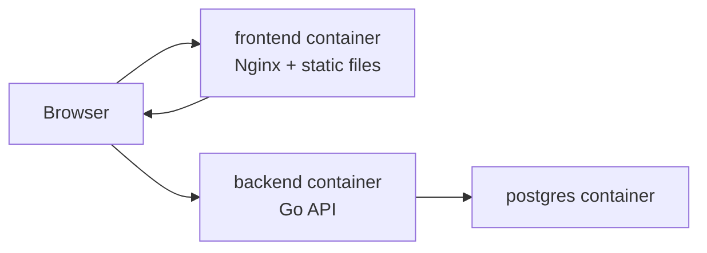

# Docker 배포 준비 가이드

이 문서는 Go Exchange MVP를 Docker 이미지로 빌드하고 Docker Compose로 실행하기 위한 로컬 배포 가이드입니다.

## 먼저 알아야 할 키워드

| 키워드 | 이 프로젝트에서의 의미 |
| --- | --- |
| Dockerfile | 백엔드/프론트 이미지를 만드는 조리법 |
| Image | 실행 가능한 애플리케이션 패키지 |
| Container | 이미지를 실제로 실행한 프로세스 |
| Multi-stage build | 빌드 도구가 들어간 단계와 실제 실행 단계를 분리하는 방식 |
| `.dockerignore` | 이미지 빌드 context에 포함하지 않을 파일 목록 |
| Environment variable | DB 주소, JWT secret, CORS origin 같은 실행 환경 설정 |
| Docker network | Compose 안의 서비스들이 `postgres`, `backend` 같은 이름으로 통신하는 네트워크 |
| Volume | PostgreSQL 데이터를 컨테이너 재시작 후에도 보존하는 저장소 |
| Healthcheck | 컨테이너가 정상 동작하는지 Docker가 주기적으로 확인하는 명령 |
| Docker Compose | frontend, backend, postgres를 한 번에 실행하는 묶음 |

## 구성 파일

백엔드 저장소:

- `Dockerfile`: Go 백엔드를 빌드하고 실행하는 이미지 정의
- `.dockerignore`: 빌드 context에서 제외할 파일 목록
- `.env.deploy.example`: Compose 실행에 필요한 환경변수 예시
- `docker-compose.deploy.yml`: PostgreSQL, 백엔드, 프론트엔드를 함께 실행하는 Compose 파일
- `GOEXCHANGE_MIGRATIONS_DIR`: 컨테이너에서 goose migration SQL을 찾을 디렉터리

프론트엔드 저장소:

- `Dockerfile`: Vite 앱을 빌드하고 Nginx로 정적 파일을 서빙하는 이미지 정의
- `nginx.conf`: SPA fallback과 `/healthz` 응답 설정
- `.dockerignore`: `node_modules`, `dist` 같은 빌드 제외 파일 목록

## 실행 전 준비

백엔드 저장소와 프론트엔드 저장소가 같은 상위 폴더 아래에 있어야 합니다.

```text
GoExchange/
  Go-exchange-back/
  Go-exchange-front/
```

백엔드 저장소에서 배포용 환경변수 파일을 만듭니다.

```powershell
Copy-Item .env.deploy.example .env.deploy
```

`.env.deploy`의 secret 값은 로컬에서만 쓸 값으로 바꿉니다.

```text
POSTGRES_PASSWORD=<local-compose-password>
GOEXCHANGE_JWT_SECRET=<long-random-local-secret>
GOEXCHANGE_DEV_TOOLS_TOKEN=<local-dev-tools-token>
VITE_DEV_TOOLS_TOKEN=<local-dev-tools-token>
```

`GOEXCHANGE_DEV_TOOLS_TOKEN`과 `VITE_DEV_TOOLS_TOKEN`은 같아야 프론트의 개발용 충전 버튼이 정상 동작합니다.

## Compose 실행

백엔드 저장소에서 실행합니다.

```powershell
docker compose --env-file .env.deploy -f docker-compose.deploy.yml up --build
```

백그라운드 실행:

```powershell
docker compose --env-file .env.deploy -f docker-compose.deploy.yml up --build -d
```

서비스 확인:

- 프론트엔드: `http://localhost:3000`
- 백엔드 ping: `http://localhost:8080/ping`
- PostgreSQL: Compose 내부 네트워크에서 `postgres:5432`로 접근

종료:

```powershell
docker compose --env-file .env.deploy -f docker-compose.deploy.yml down
```

DB volume까지 삭제:

```powershell
docker compose --env-file .env.deploy -f docker-compose.deploy.yml down -v
```

## 빌드만 확인하기

백엔드 이미지:

```powershell
docker build -t goexchange-back:local .
```

프론트 이미지:

```powershell
docker build -t goexchange-front:local ../Go-exchange-front
```

## 동작 흐름



현재 Compose 구성은 프론트가 API를 직접 `http://localhost:8080`으로 호출하는 로컬 배포 형태입니다.
Nginx reverse proxy로 `/api`와 `/ws`를 한 도메인 아래로 묶는 구성은 다음 배포 단계에서 다룹니다.
