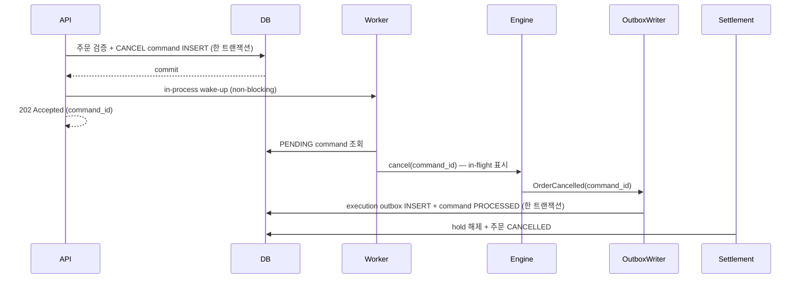

# 취소 command outbox — 설계

> **상태**: 설계. 구현·측정 없음.
> **범위**: B(정확성 부채) 1번 항목. A(성능 재측정)는 [34번](../../benchmarks/34-2026-08-18-buy-order-index-remeasurement.md)으로 동결됐다.
> **앱 코드 기준**: `fbd7517` (배포 바이너리는 `82b4d7f`와 동일)

## 1. 왜 필요한가

### 1.1 현재 순서가 만드는 창

`internal/matching/engine.go:204` `processCancel`의 순서는 이렇다.

```go
func (me *MatchingEngine) processCancel(cmd CancelOrderCommand) {
	result := me.handleCancel(cmd)      // 1. 오더북에서 제거 (메모리)
	if cmd.ResponseCh != nil {
		cmd.ResponseCh <- result        // 2. 성공 응답
	}
	if result.Removed {
		me.markDirty(cmd.CoinSymbol)
		me.emitOrderCancelled(cmd)      // 3. ExecutionCh 송신
	}
}
```

**2와 3 사이에 프로세스가 죽으면**:

1. 사용자는 취소 성공 응답을 받았다
2. 오더북 제거는 **메모리에만** 있었으므로 사라진다
3. `OrderCancelled`가 `ExecutionCh`에 못 들어가 **outbox에 기록되지 않는다**
4. DB의 주문은 여전히 `PENDING`/`PARTIAL`이다
5. 재기동 시 `matching bootstrap`이 그 주문을 **다시 오더북에 올린다**
   (34번 r1 재기동 로그: `loaded=81886 submitted=81886 pending=81883 partial=3`)
6. **취소했다고 믿은 주문이 다시 체결될 수 있다**

돈이 오가는 경로에서 사용자에게 확정을 알린 뒤 그것을 되돌리는 것이므로, 실거래 기준
배포 차단 사유다.

### 1.2 계층 간 계약이 어긋나 있다

`internal/service/order_service.go:227-233`의 주석은 이미 정확하게 적혀 있다.

> 이 함수가 반환하는 시점에는 DB가 아직 PENDING/PARTIAL일 수 있다 — **응답은 "확정"이 아니라
> "접수"다.**

그런데 `internal/handler/order_handler.go:190-191`은 **`200 OK` + `"message": "order cancelled"`**
를 반환한다. **서비스는 "접수"로 설계했는데 HTTP는 "취소됐다"고 말한다.**

즉 결함은 둘이다 — **내구성 창**과 **표현 불일치**. 둘 다 고친다.

---

## 2. 목표와 비목표

### 목표

- 취소 성공 응답이 **내구 기록 이후**에만 나간다
- **execution outbox 저장과 command `PROCESSED` 전환이 같은 DB 트랜잭션**에서 커밋된다
- 크래시 지점과 무관하게 **재실행 또는 replay 중 하나로 반드시 복구**된다
- 동일 주문의 중복 취소 요청이 **주문·hold를 두 번 건드리지 않는다**
- API가 실제 보장과 **같은 말을 한다**(202 Accepted, `ACCEPTED`)

### 비목표

- **취소 지연을 지금보다 줄이는 것** — 오히려 DB 쓰기가 하나 늘어난다. 회귀 게이트로만 관리한다
- 주문 생성 command outbox — 이번 범위 밖(B의 다음 항목은 idempotency key다)
- 매칭 quantum — 이번 dispatch 패턴이 확정된 **뒤에** 튜닝한다(§8)
- 서비스 분리·브로커 도입

---

## 3. 흐름



### 크래시 지점별 복구

| 크래시 시점 | 상태 | 복구 |
|---|---|---|
| command commit 전 | 아무것도 없음 | 사용자는 202를 못 받았다. 재요청 |
| command commit 후 ~ outbox commit 전 | command `PENDING` | 재기동 후 worker가 **재실행** |
| outbox commit 후 ~ 정산 전 | outbox `PENDING`, command `PROCESSED` | 기존 **outbox replay**가 완료 |
| 정산 후 | 완료 | — |

**모든 구간이 둘 중 하나로 덮인다.** 이것이 "같은 트랜잭션" 요구의 이유다 — 두 상태가
갈라지면 덮이지 않는 구간이 생긴다.

---

## 4. 계약

### 4.1 API

`DELETE /orders/:id`는 엔진을 직접 호출하지 않는다.

```json
{
  "message": "cancellation accepted",
  "order_id": 123,
  "command_id": 456,
  "status": "ACCEPTED"
}
```

**`202 Accepted`.** 의미는 **"취소 의도가 내구적으로 저장됐다"** 이지
**"오더북에서 이미 제거됐다"가 아니다.**

> **⚠ 이 사이에 추가 체결 가능 창이 있다.** API 문서와 UI 문구에 명시한다.
> 지금은 응답 전에 제거가 끝나 있으므로 **이것은 사용자가 체감하는 의미 변화다.**
> 내구성을 얻는 대가로 받아들이되, 숨기지 않는다.

**멱등**: `cancel_commands`는 **`UNIQUE(order_id)`** 다 — 주문은 한 번만 취소할 수 있다.
따라서 중복 요청은 시점에 따라 갈린다.

| 요청 시점 | 주문 상태 | 응답 |
|---|---|---|
| 첫 요청 | 취소 가능 | **202** + 새 `command_id` |
| command는 있으나 주문은 아직 미종결 | `PENDING`/`PARTIAL` | **202** + **기존 `command_id`** |
| 주문 최종 상태가 반영된 뒤 | `CANCELLED`/`FILLED` | **409**(기존 종결 매핑) |

두 번째 행이 §5.2에서 부분 unique index를 쓰지 않는 이유다. `PENDING` command만 막으면
**command는 `PROCESSED`인데 정산이 아직 안 끝난 창**에서 두 번째 command가 생겨
`ORDER_RELEASE`가 두 번 날 수 있다. 전체 unique면 그 창이 없다.

**기존 오류 매핑은 유지한다** — 소유권 없음, 이미 종결, 시장가 주문은 command를 만들기 전
검증 단계에서 그대로 4xx다.

### 4.2 창의 상한 — **보장하는 것과 하지 않는 것**

**보장한다**: wake-up 신호가 유실돼도 **50ms 이내에 다음 polling 시도를 시작한다.**

**보장하지 않는다**: **실제 dispatch 시작 시각**, 그리고 202 응답부터 오더북 제거까지의
end-to-end 시간. 이유는 세 가지다.

- 엔진 `CancelOrder`는 enqueue 1초와 response 1초를 **순차로** 기다린다
  (`internal/matching/engine.go:352-363`) — 단일 호출만으로 최대 **약 2초**다
- worker에 **backlog**가 있으면 dispatch 자체가 밀린다(상한 없음)
- PENDING 조회 DB 왕복이 빠져 있다

따라서 **애플리케이션 상한을 숫자로 약속하지 않는다.** 대신 `cancel_command_latency_seconds`
(command commit → `PROCESSED`/`NOOP` 커밋)를 **별도 metric으로 측정**하고,
그 분포를 근거로 나중에 상한을 논한다. **재지 않은 상한은 쓰지 않는다.**

### 4.3 worker

- **DB상 open인데 엔진이 못 찾으면 command를 지우지 않고 재시도**한다
- 주문이 **먼저 체결됐으면** command를 **terminal no-op으로 완료**한다(실패가 아니다)
- shutdown 시 **엔진 drain보다 먼저 정지**한다(§8)

**in-flight 규칙** — 엔진에 성공적으로 전달된 command는 **outbox commit 전까지 재 dispatch되지
않아야 한다.** 그렇지 않으면 50ms polling이 같은 command를 반복 투입해 엔진 큐를 채운다.

**엔진 반환은 결말이 아니다.** `processCancel`의 순서는 ① 오더북 제거 → ② `ResponseCh` 응답 →
③ `CancelOrder` 반환 → **④ `emitOrderCancelled`** 다(`engine.go:204-213`).
**반환 시점에는 이벤트가 아직 `ExecutionCh`에도 안 들어갔다.**

따라서 반환 시 in-flight를 지우면 outbox 커밋 전 다음 polling이 같은 PENDING command를
재투입한다. 그 두 번째 호출을 `NOOP`으로 커밋하면, 뒤늦게 도착한 첫 이벤트의
`PROCESSED` UPDATE가 **0행이 되어 §7(a)에 따라 배치 전체가 rollback된다** — 무관한 주문들의
execution outbox까지 함께 죽는다.

**상태는 `phase + nextAttemptAt`으로 표현한다.**

| phase | 의미 | PENDING 스캔에서 |
|---|---|---|
| `dispatching` | 엔진 호출 중 | 제외 |
| `awaiting_outbox` | 엔진은 성공 반환, **outbox 커밋 대기** | 제외 |
| `backoff` | 재시도 대기 | `now < nextAttemptAt`이면 제외 |

- **성공 반환** → **삭제하지 않고 `awaiting_outbox`로 전환**한다
- **삭제는 DB에서 `PROCESSED`/`NOOP`가 확인된 뒤에만** 한다.
  worker는 tick마다 `awaiting_outbox` ID들에 대해 `SELECT id, status WHERE id IN (...)`
  한 번을 돌린다. 이 집합은 동시 dispatch 수로 제한돼 작다.
  **PENDING 스캔 결과에서 사라졌다는 것으로 판단하지 않는다** — 스캔에 `LIMIT`이 있으면
  "안 보임"과 "완료됨"이 구분되지 않는다
- **`ErrCancelOrderNotFound`** → **DB 주문 상태로 갈린다**(§4.3 첫 줄과 같은 규칙이다)
  - 주문이 **open**(`PENDING`/`PARTIAL`) → **`NOOP`으로 만들지 않는다.** `backoff`로 재시도.
    엔진과 DB가 어긋난 상태이며, 조용히 종결하면 취소가 유실된다
  - 주문이 **terminal**(`CANCELLED`/`FILLED`) → **`NOOP` 커밋** 후 삭제
- **그 외 오류** → `backoff`, `nextAttemptAt = now + backoff`, `attempt_count` 증가
- **`awaiting_outbox`는 만료로 상태를 바꾸지 않는다.** deadline은 **경고 로그와 metric 전용**이다.
  `OutboxWriter.flushAndForward`가 이미 **커밋될 때까지 무한 재시도**하며 `ExecutionCh`에
  백프레셔를 건다(`outbox_writer.go:84`, `:104-117` 50ms→1초 지수 backoff). 따라서
  "이벤트가 흘러 없어지는" 경로는 **프로세스 죽음뿐이고, 그때는 in-flight도 함께 사라진다**
  - 만료 시 `backoff`로 되돌리면 **영구 재시도 루프가 된다** — 첫 성공에서 주문은 이미 엔진에서
    제거됐으므로 재투입은 계속 not-found이고, DB는 아직 open이라 위 분기가 계속 `backoff`를
    고른다. 결말이 나지 않는다
  - 만료가 관측되면 그것은 **DB가 오래 막혀 있다는 신호**다. 상태 기계로 우회하지 말고
    그대로 드러낸다
- in-flight는 **프로세스 로컬**이다 — 크래시하면 사라지고, 그때는 §3대로 재실행이 맞다
- backoff는 **지수**(초기 100ms, 상한 5초)다. **포기하지 않는다**

### 4.4 부팅 순서 — 복구 command가 처리되기 전에 트래픽을 받지 않는다

"bootstrap 후 worker 시작"만으로는 부족하다. bootstrap이 주문을 오더북에 다시 올린 직후
새 주문을 받으면 **취소가 처리되기 전에 체결될 수 있다.** 순서를 다음으로 고정한다.

```
1. execution outbox replay
2. matching bootstrap (open order 복원)
3. 복구된 cancel command drain — 오더북 제거까지 확인
4. HTTP/readiness 개방
```

**3이 끝나지 않으면 readiness를 열지 않는다.** 이는 §8의 shutdown 순서와 대칭이다.
3에서 어떤 command가 `PROCESSED`/`NOOP`에 도달하지 못하면 readiness를 열지 않고 **정지·보고**한다
— 취소를 못 지키면서 주문을 받는 것보다 안 받는 것이 낫다.

---

## 5. 구현이 건드리는 지점 — 이 설계의 핵심 난점

**`OutboxWriter`가 배치로 커밋한다는 사실이 "같은 트랜잭션" 요구와 직접 충돌한다.**

`internal/service/outbox_writer.go`는 `ExecutionCh`의 유일한 소비자로, **최대 512건을 모아
한 트랜잭션에 `InsertBatch`** 한다(`internal/repository/trade_outbox_repository.go:21`,
`r.DB.Create(&events)`). 그 배치에는 **여러 주문의 trade·terminal 이벤트가 섞여 있다.**

따라서 특정 취소 command를 그 트랜잭션 안에서 `PROCESSED`로 바꾸려면 **어떤 이벤트가 어떤
command에서 왔는지**를 배치가 알아야 한다.

### 5.1 필요한 변경

| 위치 | 변경 |
|---|---|
| `matching.CancelOrderCommand` | `CommandID uint64` 추가 |
| `matching.OrderCancelled` | `CommandID uint64` 추가 — 엔진이 그대로 실어 보낸다 |
| `engine.go` `emitOrderCancelled` | `cmd.CommandID`를 이벤트에 복사 |
| `OutboxWriter.flushAndForward` | 배치에서 `CommandID != 0`인 것을 모아 repo에 함께 전달 |
| `TradeOutboxRepository` | `InsertBatchAndMarkCancelCommands(events, commandIDs)` — **한 `Transaction()` 안에서** INSERT + `UPDATE cancel_commands SET status='PROCESSED'`(§7a에 정확한 계약) |
| 신규 테이블 | `cancel_commands` |
| `OrderService.CancelOrder` | 엔진 호출 제거, command INSERT + wake-up 신호 |
| 신규 worker | `CancelCommandWorker` |
| `OrderHandler.CancelOrder` | 202 + 새 응답 형태 |

> **`matching` 패키지에 필드 2개가 추가된다.** 이 패키지는 지금까지 측정 기준선의 일부였다
> (`82b4d7f`). B는 A와 분리된 작업이므로 기준선이 바뀌는 것은 예정된 일이지만,
> **B 이후의 성능 수치는 A와 직접 비교하지 않는다**(회귀 게이트로만 쓴다).

### 5.2 `cancel_commands` 스키마 (migration 007)

```sql
CREATE TABLE cancel_commands (
    id            BIGSERIAL PRIMARY KEY,
    order_id      BIGINT      NOT NULL,
    user_id       BIGINT      NOT NULL,
    coin_symbol   TEXT        NOT NULL,
    side          TEXT        NOT NULL,
    price         NUMERIC     NOT NULL,
    status        TEXT        NOT NULL DEFAULT 'PENDING',
    attempt_count INT         NOT NULL DEFAULT 0,
    last_error    TEXT,
    created_at    TIMESTAMPTZ NOT NULL DEFAULT now(),
    updated_at    TIMESTAMPTZ NOT NULL DEFAULT now(),
    CONSTRAINT cancel_commands_order_unique UNIQUE (order_id),
    CONSTRAINT cancel_commands_status_check
        CHECK (status IN ('PENDING','PROCESSED','NOOP'))
);

-- worker의 PENDING 스캔
CREATE INDEX cancel_commands_pending
    ON cancel_commands (id) WHERE status = 'PENDING';
```

**컬럼은 `matching.CancelOrderCommand`를 그대로 재구성할 수 있어야 정해진다.**
현재 구조체는 `CoinSymbol`·`OrderID`·`Side`·`Price` 네 개이며(`order_service.go:270-275`),
`handleCancel`은 **`Price`로 가격 레벨을 찾는다**(`engine.go:367`은 `Price` 미설정을 invalid로 거부).
따라서 **`price NUMERIC NOT NULL`이 필수다** — 없으면 worker가 command를 복원할 수 없다.
`user_id`는 재구성용이 아니라 조회·감사용이다.

- **`PROCESSED`**: 엔진이 제거했고 outbox에 실행 이벤트가 커밋됨
- **`NOOP`**: 이미 체결·취소돼 할 일이 없음(실패가 아님)
- `attempt_count`는 관측용이다. **재시도 예산으로 쓰지 않는다** — 취소는 포기하면 안 된다
  (`retry_count` 소진이 복구 가능성을 깎았던 `failed_order_cancellations` 사례를 반복하지 않는다)

---

## 6. 사전 등록 검증

각 항목은 **실패하는 것을 먼저 확인한 뒤** 통과시킨다.

| # | 검증 | 방법 |
|---|---|---|
| 1 | command commit 직후 크래시 → 재기동 후 취소 완료 | outbox commit 전에 프로세스 종료, 재기동 후 주문 `CANCELLED` + hold 해제 |
| 2 | outbox commit 직후 크래시 → replay가 완료 | command는 `PROCESSED`, outbox `PENDING` 상태에서 종료 → replay 확인 |
| 3 | **취소 응답 직후 종료해도 주문 부활 0** | 202 수신 직후 종료 → 재기동 시 bootstrap이 그 주문을 **복원하더라도 readiness 개방 전에 제거되며, live 주문과 체결되지 않는다**(§4.4) |
| 4 | 동일 주문 중복 취소 100회 동시 | command 1건, hold 해제 1회, 원장 `ORDER_RELEASE` **정확히 1건** |
| 4b | **`PROCESSED` 후 정산 전 재요청** | `UNIQUE(order_id)`로 두 번째 command 생성 실패 → 기존 `command_id`로 202, `ORDER_RELEASE` **여전히 1건** |
| 5 | 이미 체결된 주문 취소 | command가 **`NOOP`**, 실패 아님, 재시도 루프 없음 |
| 6 | DB open인데 엔진 미발견 | command가 `PENDING`으로 남고 재시도(삭제되지 않음) |
| 7 | **부팅 순서 장벽** | 복구 command가 `PROCESSED`/`NOOP`에 도달하기 전 **readiness가 열리지 않음**, bootstrap 직후 새 주문이 그 주문과 체결되지 않음 |
| 8 | wake-up 유실 | 신호를 버려도 **50ms 이내에 다음 polling 시도가 시작된다**(시도 시작 시각을 관측한다. **dispatch 시작 시각은 판정 대상이 아니다**) |
| 8b | **in-flight 중복 dispatch 없음** | 엔진 응답을 1초 지연시켜도 같은 `command_id`가 `CancelCh`에 **1회만** 투입 |
| 8c | **backoff 존중** | 엔진 오류를 반복시켜 재투입 간격이 100ms→5초로 **증가**하는지(`nextAttemptAt`이 없으면 50ms 고정으로 관측된다) |
| 8d | **`awaiting_outbox` 창** ⚠ | 엔진 반환 후 **outbox commit을 막고** polling tick을 여러 번 돌려 재투입이 **1회**인지 확인(**deadline을 넘겨서도 여전히 1회** — 만료는 로그·metric만) → 그다음 commit을 풀어 in-flight가 **해제**되는지 확인 |
| 8e | **not-found 분기** | 엔진 not-found + DB 주문 open → **`NOOP`이 아니라 `backoff` 재시도**. DB 주문 terminal일 때만 `NOOP` |
| 9 | `UPDATE` 불일치 rollback | `RowsAffected`가 command 수와 다르면 **outbox INSERT까지 rollback**(§7a) |
| 10 | 게이트 | **202 acceptance 성공률 · 인프라 실패율**이 새 계약의 사전 등록 임계를 만족(아래 참조) |

### 게이트와 기준선의 분리

§7(c)에서 계약이 바뀌었으므로 **34번 수치를 PASS/FAIL 비교에 쓰지 않는다.**

| 지표 | 용도 |
|---|---|
| **202 acceptance 성공률**, **인프라 실패율** | **게이트** — 새 계약의 사전 등록 임계로 판정 |
| HTTP p95, `cancel_command_latency_seconds` | **새 기준선으로 기록** — 이번엔 판정하지 않는다 |
| 34번의 취소 성공률·p95 | **참고만** — PASS/FAIL 비교에 사용하지 않는다 |

두 번째 행은 다음 변경분의 회귀 게이트가 된다. **첫 측정은 기준선이지 합격선이 아니다.**

> **4번의 판정 기준은 상태가 아니라 `ORDER_RELEASE` 원장 건수다.** 33번에서 확인했듯
> `ProcessOrderCancellation`은 no-op일 때도 **에러 없이 성공**하므로 상태·에러로는 구분되지 않는다.

---

## 7. 확정된 결정

### (a) `InsertBatchAndMarkCancelCommands`의 정확한 계약 ✅

**A안 채택**: `InsertBatch`를 트랜잭션으로 감싸고 같은 트랜잭션에서 command를 마킹한다.
별도 트랜잭션 2개는 §3의 복구 표에 구멍을 만들어 이 설계의 근거 자체를 없앤다.

> **"왕복 1회 유지"는 틀린 표현이었다.** SQL은 INSERT와 UPDATE **두 문장**이다.
> 보존되는 것은 왕복 수가 아니라 **단일 commit / 단일 fsync**다.

`UPDATE`가 지켜야 할 조건:

- `commandIDs`는 **중복 제거된 nonzero 값만** 사용한다(같은 배치에 같은 command가 두 번 들어올 수 있다)
- `WHERE id IN (...) AND status = 'PENDING'` — `PROCESSED`를 덮어쓰지 않는다
- **`RowsAffected == len(commandIDs)`** 를 확인한다
- 불일치하면 **error를 반환해 트랜잭션 전체를 rollback**한다(outbox INSERT 포함).
  불일치는 "이미 처리됐다" 또는 "command가 없다"이며, 둘 다 조용히 넘기면 안 되는 상태다
- **취소 이벤트가 없는 배치에서는 UPDATE를 생략**한다(기존 경로의 비용을 늘리지 않는다)

### (b) wake-up 신호의 형태 ✅

버퍼 1짜리 채널에 non-blocking send(`select { case ch <- struct{}{}: default: }`).
신호가 뭉쳐도 worker가 **PENDING 전체를 스캔**하므로 유실이 아니다. 50ms polling은 backstop.

### (c) 202 전환 — 클라이언트 변경은 **같은 작업 범위** ✅

**200 호환 유지는 채택하지 않는다.** 실제 의미를 계속 왜곡하기 때문이다.

프런트는 202 자체는 성공으로 받지만 **응답 본문을 확정으로 해석**한다.
[api.ts:74](../../../../Go-exchange-front/src/lib/api.ts)의 `CancelOrderResponse`는
`status: "CANCELLED"`·`released_asset`·`released_amount`를 요구하고,
[AuthPanel.tsx:130](../../../../Go-exchange-front/src/components/trading/AuthPanel.tsx)은
그 값으로 `` `${result.released_amount} ${result.released_asset} 반환 완료` `` 를 만든다.
새 응답에는 그 필드가 없으므로 화면에 **`undefined undefined 반환 완료`** 가 뜬다.

새 계약:

| 대상 | 변경 |
|---|---|
| `api.ts` | `CancelOrderResponse` → `{ message, order_id, command_id, status: "ACCEPTED" }` |
| `AuthPanel.tsx` | 202 직후 **"취소 요청 접수됨"**. 해제 금액을 응답에서 읽지 않는다 |
| 최종 상태 | **기존 주문 조회를 polling**해 `CANCELLED`/`FILLED`를 확인한 뒤 표시 |
| E2E | 즉시 최종 상태 단언 → **eventual assertion** |
| k6 `sli-classify.js` | **200·202를 성공으로 분류** |

**UI polling의 종료 조건** — §4.2대로 end-to-end 상한이 없으므로 **타임아웃을 실패로 표시하면
안 된다.**

| 관측 | 표시 |
|---|---|
| 주문 `CANCELLED` | **취소 완료** |
| 주문 `FILLED` | **취소 전에 체결 완료**(취소 실패가 아니다) |
| polling 시간 초과 | **"접수됨 · 처리 중" 유지** — 실패로 바꾸지 않는다 |
| 컴포넌트 unmount · 로그아웃 | **polling 중단**(진행 중 요청 취소, 상태 갱신 금지) |

> **이 항목이 측정 하니스를 바꾼다.** 34번까지의 취소 성공률과 **직접 비교하지 않고**,
> 새 계약의 **기준선으로 새로 기록**한다.

---

## 8. 후속 제약 (이미 합의된 것)

- **`maxConsecutiveCancels`는 이 worker의 최종 dispatch 패턴 위에서 정한다.** 초기 후보 64를
  outbox 이후 재측정 없이 고정하지 않는다. 취소 도착 패턴이 HTTP 직접 투입에서 worker
  dispatch로 바뀌기 때문이다
- **`maxMatchesPerTurn`은 취소 burst quantum과 별개다** — 큰 aggressive order의 sweep을 slice하되
  진행 중 incoming order는 새 주문보다 앞에 유지한다
- **shutdown은 진행 중 sweep을 선점하지 않는다.** active order를 rest 또는 terminal로 종결한 뒤
  `stopCh`를 처리한다
- **shutdown 단계 순서**: readiness 차단 → HTTP drain → hold coordinator → **cancel worker 정지** →
  matching engine drain → execution outbox flush → settlement drain → background 종료.
  cancel worker가 엔진보다 먼저 멈춰야 drain 중 새 dispatch가 들어오지 않는다.
  **부팅 순서(§4.4)와 정확히 대칭이다** — 마지막에 여는 것을 가장 먼저 닫는다
- sweep slice 사이 취소를 허용하면 **resting maker가 뒤의 체결을 피할 수 있다.** 기존의
  incoming-order 단위 체결 원자성을 포기하고 취소 진행성을 택한 **명시적 대가**다

---

## 9. 완료 정의

1. §6의 15개 검증이 **RED → GREEN**으로 기록됐다
2. `matching` 패키지 변경이 기존 테스트(`-race` 포함)를 깨지 않는다
3. 202 전환이 **프런트(`api.ts`·`AuthPanel.tsx`)·E2E·k6**에 반영됐고,
   **하니스가 바뀌었음을 결과에 명시**했다
4. **202 acceptance 성공률·인프라 실패율 게이트**를 통과했다(§6)
5. HTTP p95와 `cancel_command_latency_seconds` 분포가 **새 기준선으로 기록**됐다
   — **상한 약속도 합격선도 아니다**(§4.2). **34번 수치와 PASS/FAIL 비교하지 않았다**
6. `maxConsecutiveCancels` 재튜닝이 **후속 항목으로 남아 있음**이 문서에 있다
